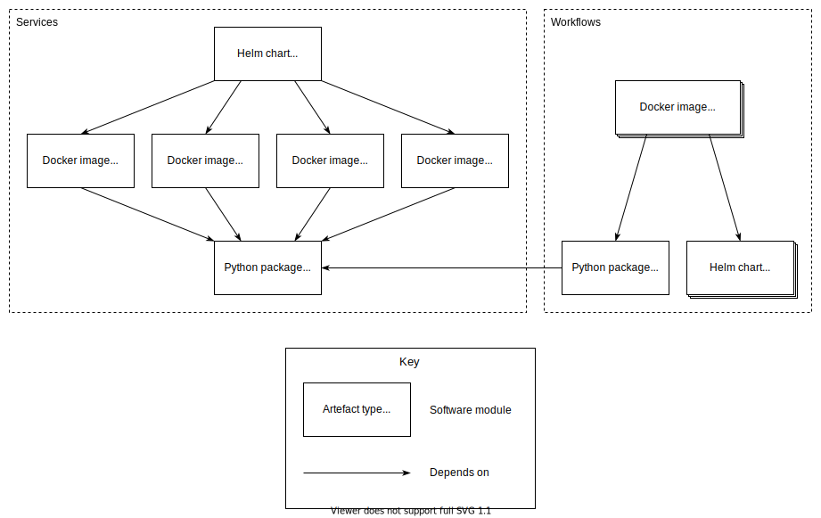

.. _design_modules:

Modules
=======

  SDP software modules.

The SDP is built from software modules which produce a number of different
types of artefacts. The components of the system are built as Docker images
which are deployed on a Kubernetes cluster using a Helm chart. The Docker
images depend on libraries containing common code. The diagram shows the SDP
modules and the dependencies beween them.

The source code is hosted in the `SKA Science Data Processor group in GitLab
<https://gitlab.com/ska-telescope/sdp>`_, in the following repositories:

* `ska-sdp-integration <https://gitlab.com/ska-telescope/sdp/ska-sdp-integration>`_

  Integration of components into the SDP system. Contains the Helm chart to
  deploy the SDP, and this documentation.

* `ska-sdp-config <https://gitlab.com/ska-telescope/sdp/ska-sdp-config>`_

  Library providing the interface to the configuration database.

* `ska-sdp-workflow <https://gitlab.com/ska-telescope/sdp/ska-sdp-workflow>`_

  Library providing the high-level interface for writing workflows.

* `ska-sdp-lmc <https://gitlab.com/ska-telescope/sdp/ska-sdp-lmc>`_

  Tango devices for local monitoring and control.

* `ska-sdp-proccontrol <https://gitlab.com/ska-telescope/sdp/ska-sdp-proccontrol>`_

  Processing controller.

* `ska-sdp-helmdeploy <https://gitlab.com/ska-telescope/sdp/ska-sdp-helmdeploy>`_

  Helm deployer.

* `ska-sdp-console <https://gitlab.com/ska-telescope/sdp/ska-sdp-console>`_

  Console used to interact with the configuration database.

* `ska-sdp-science-pipelines
  <https://gitlab.com/ska-telescope/sdp/ska-sdp-science-pipelines>`_

  Science pipeline workflows.

* `ska-sdp-helmdeploy-charts
  <https://gitlab.com/ska-telescope/sdp/ska-sdp-helmdeploy-charts>`_

  Charts used by the Helm deployer to deploy workflows and processing
  components/functions.
